# Adoption Patterns: Databricks Apps

## App Archetypes Seeing Traction

Three distinct patterns of apps are gaining adoption:

---

## Archetype 1: Business Cockpit Apps

### Definition
An application that gives business persons a clear understanding of their business across the analytics maturity spectrum.

### The Analytics Maturity Stack

```mermaid
flowchart TB
    subgraph cockpit["🎯 BUSINESS COCKPIT APP"]
        direction TB
        P["<b>PRESCRIPTIVE</b><br/>What should be done about it?"]
        S["<b>SIMULATIONS</b><br/>How to plan for different scenarios?"]
        PR["<b>PREDICTIVE</b><br/>Where is the business going?"]
        C["<b>CAUSAL</b><br/>What is causing current state?"]
        D["<b>DESCRIPTIVE</b><br/>Where is the business now?"]
        
        P --> S --> PR --> C --> D
    end
    
    cockpit --> V["📊 Business users get FULL VISIBILITY without SQL skills"]
```



### Characteristics

| Dimension | Description |
|-----------|-------------|
| **Target User** | Business executives, analysts, operations managers |
| **Value Prop** | Full business visibility without technical skills |
| **AI Integration** | Predictions, scenarios, recommendations |
| **Data Needs** | Aggregated operational + analytical data |
| **Databricks Fit** | Perfect—leverages Lakehouse + ML + Lakebase |

### Example Use Cases
- Executive dashboard with scenario planning
- Operations command center with anomaly detection
- Sales forecasting with prescription recommendations
- Supply chain visibility with risk simulation

---

## Archetype 2: Deeply Vertical Apps

### Definition
Applications that address a deep pain point for a customer or completely disrupt a process/approach for specific industry tasks.

### Characteristics

| Dimension | Description |
|-----------|-------------|
| **Target User** | Domain specialists, industry practitioners |
| **Value Prop** | Solve unsolvable problems or 10x process improvement |
| **AI Integration** | Often leverages cutting-edge AI (diffusion models, etc.) |
| **Data Needs** | Specialized, often proprietary data |
| **Databricks Fit** | Good—leverages AI platform + data gravity |

### Example Use Cases

| Industry | Use Case | Disruption |
|----------|----------|------------|
| **Manufacturing** | AI-based product design | Replace months of R&D with generative design |
| **Healthcare** | Clinical trial optimization | Accelerate drug development timelines |
| **Financial Services** | Real-time fraud network analysis | Move from batch to streaming detection |
| **Retail** | Demand sensing with external signals | Replace spreadsheet forecasting |

### Key Success Factor
These apps require **deep domain expertise** to build. Often require:
- Industry-specific data models
- Specialized AI/ML capabilities
- Domain expert involvement in design

---

## Archetype 3: Horizontal Apps

### Definition
Applications that greatly improve productivity within the platform for existing users OR reduce the barrier of entry for new user segments.

### Characteristics

| Dimension | Description |
|-----------|-------------|
| **Target User** | Platform users, data stewards, analysts |
| **Value Prop** | Democratize capabilities, reduce skill requirements |
| **AI Integration** | Often AI-assisted to lower skill barrier |
| **Data Needs** | Works with existing platform data |
| **Databricks Fit** | Excellent—extends platform value |

### Example Use Cases

| App Type | Description | Value |
|----------|-------------|-------|
| **Data Quality Checks** | Business/data rules defined by non-SQL users | Data stewards don't need SQL |
| **Catalog Browser** | Visual data discovery for business users | Analysts don't need Unity Catalog expertise |
| **Query Builder** | Natural language to SQL | Business users can self-serve |
| **Notebook Publisher** | Turn notebooks into shareable apps | Data scientists become app builders |

### Key Success Factor
These apps **expand the addressable user base** for Databricks:
- Non-technical users can access platform capabilities
- Technical users can 10x their productivity
- Creates "land and expand" motion within accounts

---

## Adoption Pattern Summary

| Archetype | Primary Buyer | Expansion Path | Complexity |
|-----------|---------------|----------------|------------|
| **Business Cockpit** | Business exec + Data team | Drives DW, ML adoption | Medium |
| **Deeply Vertical** | Industry LoB + Data team | Drives specialized ML, ETL | High |
| **Horizontal** | Platform team | Drives platform-wide adoption | Low-Medium |

---

## Archetype Targeting Matrix

Archetypes are **not mutually exclusive**—a customer may fit multiple patterns. Use signals to identify which archetypes apply:

| Signal | Cockpit | Vertical | Horizontal |
|--------|:-------:|:--------:|:----------:|
| **Unity Catalog adopted** | ✅ | | |
| **AI/ML maturity (models in prod)** | | ✅ | |
| **Large business user base** | ✅ | | ✅ |
| **Deep domain pain point** | | ✅ | |
| **Platform productivity needs** | | | ✅ |
| **Strong data gravity** | ✅ | ✅ | |
| **Executive sponsorship** | ✅ | ✅ | |
| **Small technical team** | | | ✅ |

**How to Use:**
1. Assess customer against each signal
2. Check which archetypes light up
3. Multiple ✅ = pursue multiple playbooks in parallel
4. Prioritize based on customer's stated priorities

---

## Quality vs Quantity: Two Adoption Motions

Apps adoption requires **two distinct motions** based on customer profile. Matching motion to customer is critical for retention.

### The Framework

```
┌─────────────────────────────────────────────────────────────────┐
│                    QUALITY vs QUANTITY                          │
├─────────────────────────────────────────────────────────────────┤
│                                                                 │
│   QUALITY MOTION              QUANTITY MOTION                   │
│   ──────────────              ───────────────                   │
│   Business outcome focus      Developer experience focus        │
│   Few apps, deep impl         Many apps, lightweight            │
│   Pro Services support        IDE integration critical          │
│   High stickiness             Dev mindshare governs             │
│   Strategic Wins metric       Coverage metric                   │
│   Early phase (P1)            Later phase (P2-3)                │
│                                                                 │
│   → Enterprise accounts       → Digital Native accounts         │
│                                                                 │
└─────────────────────────────────────────────────────────────────┘
```

### Motion Comparison

| Dimension | Quality Motion | Quantity Motion |
|-----------|----------------|-----------------|
| **Customer Profile** | Business outcome-oriented | Tech/Developer-centric |
| **Typical Segment** | Enterprise, Regulated | Digital Native (DN) |
| **App Count** | Few (1-5 deep apps) | Many (10+ lightweight apps) |
| **Implementation Depth** | Deep, production-grade | Lightweight, often ephemeral |
| **Success Metric** | Strategic Wins, Retention | Coverage, Active Developers |
| **Support Model** | Professional Services | Self-serve, IDE integration |
| **Phase Focus** | P1 (Prove It) | P2-P3 (Scale/Expand) |
| **Stickiness Driver** | Business value delivered | Developer mindshare |

### Current Reality (Data Signal)

| Metric | Current State | Implication |
|--------|---------------|-------------|
| **Retention** | Low | Motion-customer mismatch likely |
| **Active Users per App** | Low (power law) | Few apps get most usage |
| **Distribution** | Power law | Quality apps drive value, most apps are low-use |

**Root Cause Hypothesis:** Without intentional motion design, apps default to low-value patterns. Deep implementations with PS support create stickiness; shallow implementations churn.

### How to Select Motion

| If Customer... | Then Use... | Why |
|----------------|-------------|-----|
| Talks about business outcomes | Quality | Need deep implementation |
| Has few developers, business sponsor | Quality | PS support required |
| Is regulated (FSI, HLS) | Quality | Compliance requires depth |
| Has large dev team, tech-forward | Quantity | Dev mindshare critical |
| Is Digital Native | Quantity | IDE/dev experience matters |
| Wants many small tools | Quantity | Coverage metric applies |

### Motion-Specific Playbook Elements

**Quality Motion Playbook:**
- Engage Professional Services early
- Document business value delivered
- Track retention and active users
- Deep discovery workshop
- Executive sponsorship required
- Measure: Strategic Wins, Retention Rate

**Quantity Motion Playbook:**
- Prioritize IDE/dev experience
- Self-serve enablement
- Developer community building
- Lightweight templates and accelerators
- Track developer adoption
- Measure: Coverage, Apps Created, Active Developers

---

## Use Case Qualification Framework

### Fit Assessment Questions

1. **Is the use case net-new or migration?**
   - Net-new → Good fit
   - Legacy migration → Not ready yet

2. **Does it leverage Databricks data gravity?**
   - Data already in Lakehouse → Strong fit
   - Requires new data onboarding → Okay fit
   - Data in competitor platform → Weak fit

3. **Does it require AI/ML?**
   - Yes, AI-powered → Differentiator
   - No AI needed → Still fits, but weaker moat

4. **Who is the end user?**
   - Business users → Good (expands addressable market)
   - Technical users only → Okay (platform extension)

5. **What's the governance requirement?**
   - Strict governance needed → Strong fit (moat)
   - Loose governance → Less differentiated

---

## Guided Selling Triggers

### Why Guided Selling Matters
FE often doesn't recognize Apps opportunities even when present. These triggers help identify when to bring Apps into the conversation.

### Conversation Triggers by Archetype

| Customer Says/Does | Apps Opportunity? | Archetype | Next Step |
|--------------------|-------------------|-----------|-----------|
| "We need a dashboard for executives" | ✅ Yes | Cockpit | Qualify: What decisions? What data? |
| "Our BI tool isn't working for business users" | ✅ Yes | Cockpit/Horizontal | Demo: Self-serve analytics app |
| "We have ML models but can't operationalize them" | ✅ Yes | AI App | Explore: Model serving in app layer |
| "We need real-time visibility into operations" | ✅ Yes | Cockpit | Qualify: What operations? Latency needs? |
| "Our industry has a unique problem no tool solves" | ✅ Yes | Vertical | Explore: Custom app opportunity |
| "Data team is bottleneck for business requests" | ✅ Yes | Horizontal | Demo: Self-serve data quality app |
| "We want to build a customer-facing portal" | ⚠️ Maybe | - | Check: Internal or external? (External = wait) |
| "We need to migrate our Java apps" | ❌ No | - | Defer: Not ready yet |
| "We need infinite scalability" | ❌ No | - | Defer: Vertical scaling only today |

### Account Signals to Watch

| Signal in Account | Apps Opportunity? | Why |
|-------------------|-------------------|-----|
| Unity Catalog adopted | ✅ Strong | Governance foundation ready |
| ML models in production | ✅ Strong | AI App opportunity |
| Business users requesting data access | ✅ Strong | Horizontal App opportunity |
| Large data footprint in Lakehouse | ✅ Strong | Data gravity for Apps |
| Executive sponsor identified | ✅ Strong | Top-down adoption path |
| Industry-specific pain point mentioned | ✅ Strong | Vertical App opportunity |
| No Databricks footprint | ❌ Weak | Cold start too hard |
| Legacy migration is priority | ❌ Weak | Not ready yet |

### How to Use Triggers

1. **Listen:** In every customer conversation, listen for trigger phrases
2. **Recognize:** Match triggers to archetype opportunities
3. **Qualify:** Use the Fit Assessment Questions (above) to validate fit
4. **Position:** If qualified, introduce Apps with honest positioning
5. **Demo:** Schedule App First Demo relevant to their vertical

### Trigger Adoption Tracking

| Metric | Definition | Target |
|--------|------------|--------|
| **Trigger Recognition Rate** | % of FE who can identify 3+ triggers | TBD |
| **Trigger-to-Opportunity Rate** | % of triggers that become qualified opportunities | TBD |
| **Opportunity-to-Win Rate** | % of Apps opportunities that close | TBD |

---

## Adoption Signal Tracking

### Leading Indicators

| Signal | What It Indicates |
|--------|-------------------|
| Unity Catalog adoption | Governance readiness for Apps |
| ML model deployment | AI integration opportunity |
| Large data footprint | Data gravity for Apps |
| Business user access requests | Demand for self-serve Apps |

### Lagging Indicators

| Signal | What It Indicates |
|--------|-------------------|
| Apps SKU adoption | Direct revenue |
| Multi-app deployments | Platform stickiness |
| Cross-workload expansion | Influenced revenue |

---

## Gaps to Address

- [ ] Build reference architectures for each archetype
- [ ] Create qualification playbook for field teams
- [ ] Identify and profile 2-3 lighthouse customers per archetype
- [ ] Develop demo assets for each pattern
- [ ] Define adoption metrics per archetype

---

*Last Updated: January 2026*

