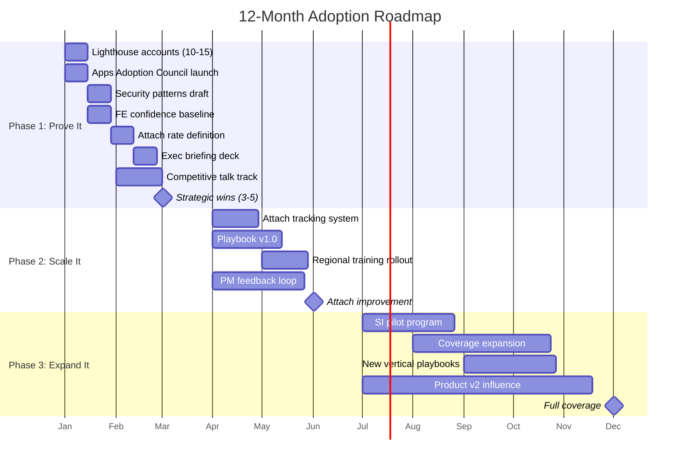

# 3-6-12 Month Action Plan

*Action-oriented plan with specific deliverables, owners, and timelines.*

**Related Documents:** [Hypotheses](08_hypotheses_and_beliefs.md) | [Traceability](12_traceability.md) | [Strategic Gaps](11_strategic_gaps.md)

---

## Hypothesis-Action Connection

Each action in this plan tests one or more hypotheses. Use [12_traceability.md](12_traceability.md) for the full validation chain.

| Phase | Primary Hypotheses Tested | Decision Point |
|-------|---------------------------|----------------|
| **P1 (M1-3)** | H3 (FE Enablement), H6 (Metrics Align BUs) | Month 3: Is enablement working? Do BU leaders buy metrics? |
| **P2 (M4-6)** | H1 (Tip of Spear), H4 (Three Archetypes), H7 (Net-New) | Month 6: Is attach rate improving? Do archetypes hold? |
| **P3 (M7-12)** | H2 (Ecosystem Moat), H5 (SI vs FDE) | Month 9: Is SI pilot working? Is moat real? |

---

## Plan Overview

```
┌─────────────────────────────────────────────────────────────────┐
│                    3-6-12 MONTH ROADMAP                         │
├─────────────────────────────────────────────────────────────────┤
│                                                                 │
│   MONTH 1-3              MONTH 4-6              MONTH 7-12      │
│   ─────────              ─────────              ──────────      │
│   PROVE IT               SCALE IT               EXPAND IT       │
│                                                                 │
│   • Strategic wins       • Attach tracking      • Coverage push │
│   • Enablement sprint    • Playbook v1          • SI motion     │
│   • Operating cadence    • Scaled training      • Product v2    │
│   • Exec alignment       • PM influence         • New verticals │
│                                                                 │
│   North Star:            North Star:            North Star:     │
│   Strategic Wins         Attach Rates           Coverage        │
│                                                                 │
└─────────────────────────────────────────────────────────────────┘
```

### Visual Roadmap



---

## Phase 1: Prove It (Month 1-3)

### Objective
Land 3-5 strategic wins that prove Apps can drive deep platform adoption.

### Key Results

| KR | Target | Measurement |
|----|--------|-------------|
| KR1 | 3-5 strategic wins documented | Win narratives with business value |
| KR2 | FE enablement for top 3 topics complete | Training completion rate |
| KR3 | Apps Adoption Council launched | Weekly cadence established |
| KR4 | Exec alignment with 3+ BU leaders | Sponsorship commitments |

---

### Month 1: Foundation

| Week | Deliverable | Tests Hypothesis | Owner | Done |
|------|-------------|------------------|-------|------|
| **W1** | Lighthouse account list (10-15 accounts) | H1, H4 | Adoption Architect | ⬜ |
| **W1** | Apps Adoption Council charter + invite | All | Adoption Architect | ⬜ |
| **W2** | Security/governance patterns v1 (draft) | H3 | Adoption Architect | ⬜ |
| **W2** | First Apps Adoption Council meeting | All | Adoption Architect | ⬜ |
| **W2** | FE confidence survey (baseline) | H3 | Adoption Architect | ⬜ |
| **W3** | Lighthouse account outreach (top 5) | H1, H4 | Adoption Architect + FE | ⬜ |
| **W3** | Competitive talk track v1 (Palantir focus) | H5 | Adoption Architect | ⬜ |
| **W4** | Exec briefing deck for SVP/VP alignment | H6 | Adoption Architect | ⬜ |
| **W4** | App discovery workshop design | H3, H4 | Adoption Architect + Enablement | ⬜ |
| **W3-4** | Align with 3 industry leads on Apps use cases | H3 | Adoption Architect | ⬜ |
| **W4** | Create guided selling triggers v1 | H3 | Adoption Architect | ⬜ |

**Month 1 Checkpoint:** Council running, lighthouse accounts identified, first enablement drafts ready, FE baseline captured, industry leads engaged.

---

### Month 2: Enablement Sprint

| Week | Deliverable | Tests Hypothesis | Owner | Done |
|------|-------------|------------------|-------|------|
| **W5** | Security/governance patterns finalized | H3 | Adoption Architect | ⬜ |
| **W5** | Exec alignment meetings (2-3 SVP/VPs) | H6 | Adoption Architect | ⬜ |
| **W6** | Security patterns training pilot (HLS + FSI) | H3 | Adoption Architect + Enablement | ⬜ |
| **W6** | Lighthouse account deep-dives (3 accounts) | H1, H4, H7 | Adoption Architect + FE | ⬜ |
| **W7** | App discovery workshop pilot | H3, H4 | Adoption Architect + Enablement | ⬜ |
| **W7** | Competitive talk track training | H5 | Adoption Architect | ⬜ |
| **W8** | First strategic win candidate identified | H1 | Adoption Architect + FE | ⬜ |
| **W8** | Attach rate definition proposal to BU leaders | H6 | Adoption Architect | ⬜ |
| **W6-8** | Document "Month of Apps" playbook (Retail/Travel/CG) | H3 | Adoption Architect | ⬜ |
| **W7** | Propose Apps demo for Data+AI Summit 2026 | H3 | Marketing + AA | ⬜ |
| **W8** | Guided selling triggers training pilot | H3 | Adoption Architect | ⬜ |

**Month 2 Checkpoint:** First enablement delivered, lighthouse accounts progressing, exec buy-in building, hackathon playbook documented.

---

### Month 3: First Wins

| Week | Deliverable | Tests Hypothesis | Owner | Done |
|------|-------------|------------------|-------|------|
| **W9** | Strategic win #1 documented | H1, H4 | Adoption Architect + FE | ⬜ |
| **W9** | Enablement scaled to all regulated verticals | H3 | Enablement team | ⬜ |
| **W10** | Loss analysis framework v1 | H2, H7 | Adoption Architect | ⬜ |
| **W10** | PM feedback synthesis (Q1) | All | Adoption Architect | ⬜ |
| **W11** | Strategic win #2-3 in progress | H1, H4 | Adoption Architect + FE | ⬜ |
| **W11** | BU+1 newsletter #1 (Apps edition) | H6 | Adoption Architect | ⬜ |
| **W12** | FE confidence survey (post-enablement) | H3 | Adoption Architect | ⬜ |
| **W12** | Phase 1 retrospective + Phase 2 plan | All | Adoption Architect | ⬜ |
| **W12** | Exec readout on strategic wins | H6 | Adoption Architect | ⬜ |
| **W10-12** | Define EBC Apps coverage standard with EBC team | H3 | AA + EBC Team | ⬜ |
| **W11** | Create App First Demo repository (links) | H3 | AA + Industry Leads | ⬜ |

**Month 3 Checkpoint:** 2-3 strategic wins, enablement scaled, exec alignment confirmed, EBC standard defined, demo repository live.

### Phase 1 Hypothesis Decisions (End of Month 3)

| Hypothesis | Decision Criteria | If Validated | If Invalidated |
|------------|-------------------|--------------|----------------|
| **H3** | FE confidence improved ≥20% | Scale enablement to all verticals | Investigate product blockers |
| **H6** | 3+ BU leaders accept metrics | Operationalize attach tracking | Revise metric definitions |

---

## Phase 2: Scale It (Month 4-6)

### Objective
Build attach rate tracking and scale proven playbooks across verticals.

### Key Results

| KR | Target | Measurement |
|----|--------|-------------|
| KR1 | Attach rate tracking live | Dashboard operational |
| KR2 | Playbook v1 published | Field adoption rate |
| KR3 | 5+ additional strategic wins | Win narratives |
| KR4 | PM roadmap influence demonstrated | Features prioritized |

---

### Month 4: Measurement Foundation

| Week | Deliverable | Tests Hypothesis | Owner | Done |
|------|-------------|------------------|-------|------|
| **W13** | Attach rate tracking implementation | H1, H6 | Adoption Architect + Analytics | ⬜ |
| **W13** | Strategic win playbook outline | H4 | Adoption Architect | ⬜ |
| **W14** | Reference architecture v1 (backend patterns) | H3 | Adoption Architect + PM | ⬜ |
| **W14** | Lighthouse expansion (10 new accounts) | H1, H4 | Adoption Architect + FE | ⬜ |
| **W15** | Attach rate dashboard v1 | H1, H6 | Analytics + Adoption Architect | ⬜ |
| **W15** | Cost/scaling guidance v1 | H7 | Adoption Architect + PM | ⬜ |
| **W16** | BU+1 newsletter #2 | H6 | Adoption Architect | ⬜ |
| **W16** | PM feedback prioritization review | All | Adoption Architect + PM | ⬜ |
| **W14-16** | EBC Apps coverage pilot (5 strategic customers) | H3 | AA + EBC Team | ⬜ |
| **W15** | Industry use case playbook: Retail | H3, H4 | AA + Retail Lead | ⬜ |

---

### Month 5: Playbook Development

| Week | Deliverable | Tests Hypothesis | Owner | Done |
|------|-------------|------------------|-------|------|
| **W17** | Business Cockpit playbook draft | H4 | Adoption Architect | ⬜ |
| **W17** | Deep Vertical playbook draft | H4 | Adoption Architect | ⬜ |
| **W18** | Playbook pilot with 2 FE teams | H4 | Adoption Architect + FE | ⬜ |
| **W18** | Reference architecture v1 (frontend patterns) | H3 | Adoption Architect + PM | ⬜ |
| **W19** | Playbook feedback integration | H4 | Adoption Architect | ⬜ |
| **W19** | Strategic wins #4-5 documented | H1 | Adoption Architect + FE | ⬜ |
| **W20** | Discovery workshop scaled (all verticals) | H3 | Enablement team | ⬜ |
| **W20** | Competitive intel refresh (hyperscalers) | H2, H5 | Adoption Architect | ⬜ |
| **W18-20** | Industry use case playbooks: FSI, HLS | H3, H4 | AA + Industry Leads | ⬜ |
| **W19** | Launch "Month of Apps" in FSI | H3 | FSI Lead + AA | ⬜ |

---

### Month 6: Scale and Measure

| Week | Deliverable | Tests Hypothesis | Owner | Done |
|------|-------------|------------------|-------|------|
| **W21** | Playbook v1 published | H4 | Adoption Architect | ⬜ |
| **W21** | Attach rate baseline established | H1 | Adoption Architect + Analytics | ⬜ |
| **W22** | Playbook training for all FE | H3, H4 | Enablement team | ⬜ |
| **W22** | PM roadmap influence report | All | Adoption Architect | ⬜ |
| **W23** | BU+1 newsletter #3 | H6 | Adoption Architect | ⬜ |
| **W23** | SI partnership assessment | H5 | Adoption Architect | ⬜ |
| **W24** | Win rate analysis: Net-new vs migration | H7 | Adoption Architect | ⬜ |
| **W24** | Phase 2 retrospective + Phase 3 plan | All | Adoption Architect | ⬜ |
| **W24** | H1 exec readout | H6 | Adoption Architect | ⬜ |
| **W22-24** | Launch "Month of Apps" in HLS | H3 | HLS Lead + AA | ⬜ |
| **W23** | Demo video library for field use | H3 | Marketing + AA | ⬜ |
| **W24** | EBC Apps coverage scaled to 10+ customers | H3 | AA + EBC Team | ⬜ |

**Phase 2 Checkpoint:** Attach tracking live, playbooks published, 5+ strategic wins, 2 hackathons launched, EBC coverage scaled.

### Phase 2 Hypothesis Decisions (End of Month 6)

| Hypothesis | Decision Criteria | If Validated | If Invalidated |
|------------|-------------------|--------------|----------------|
| **H1** | Attach rate measurable and positive | Emphasize "tip of spear" narrative | Reposition Apps as standalone value |
| **H4** | 80%+ wins fit 3 archetypes | Scale archetype playbooks | Refine or expand archetypes |
| **H7** | Net-new win rate > migration | Maintain net-new focus | Reconsider migration for FY27 |

---

## Phase 3: Expand It (Month 7-12)

### Objective
Drive coverage expansion and establish sustainable operating rhythm.

### Key Results

| KR | Target | Measurement |
|----|--------|-------------|
| KR1 | Coverage: 50+ unique accounts with production Apps | Telemetry |
| KR2 | Attach rate improvement vs. baseline | Dashboard |
| KR3 | SI partnership pilot | 1-2 SIs engaged |
| KR4 | Playbook v2 with product updates | Field adoption |

---

### Month 7-9: Coverage Push

| Deliverable | Tests Hypothesis | Owner | Target Date | Done |
|-------------|------------------|-------|-------------|------|
| Coverage campaign launch (by vertical) | H1 | Adoption Architect + FE | M7 W1 | ⬜ |
| SI partner identification (App-first) | H5 | Adoption Architect + Partners | M7 W2 | ⬜ |
| Horizontal apps playbook draft | H4 | Adoption Architect | M7 W4 | ⬜ |
| SI enablement program design | H5 | Adoption Architect + Partners | M8 W2 | ⬜ |
| Product v2 features integrated into playbooks | H2 | Adoption Architect | M8 W4 | ⬜ |
| Multi-product correlation analysis | H2 | Analytics + Adoption Architect | M8 W4 | ⬜ |
| Coverage milestone: 30 accounts | H1 | FE teams | M9 W2 | ⬜ |
| SI pilot launch (1-2 partners) | H5 | Partners + Adoption Architect | M9 W4 | ⬜ |

---

### Month 10-12: Sustainable Operations

| Deliverable | Tests Hypothesis | Owner | Target Date | Done |
|-------------|------------------|-------|-------------|------|
| Playbook v2 published | H4 | Adoption Architect | M10 W2 | ⬜ |
| Attach rate target achievement | H1 | Adoption Architect + FE | M10 W4 | ⬜ |
| SI pilot retrospective | H5 | Partners + Adoption Architect | M11 W2 | ⬜ |
| Coverage milestone: 50 accounts | H1 | FE teams | M11 W4 | ⬜ |
| Competitive win rate analysis | H2 | Adoption Architect | M11 W4 | ⬜ |
| FY27 plan draft | All | Adoption Architect | M12 W2 | ⬜ |
| Annual retrospective + learnings | All | Adoption Architect | M12 W4 | ⬜ |

**Phase 3 Checkpoint:** 50+ accounts, attach rate improved, SI motion validated.

### Phase 3 Hypothesis Decisions (End of Month 9-12)

| Hypothesis | Decision Criteria | If Validated | If Invalidated |
|------------|-------------------|--------------|----------------|
| **H2** | Win rate vs hyperscalers improving, multi-product correlation positive | Double down on ecosystem messaging | Compete on specific features |
| **H5** | SI time-to-value ≤ internal, SI CSAT ≥ internal | Scale SI program for FY27 | Consider internal FDE build |

---

## Deliverables Summary

### Enablement Artifacts

| Artifact | Tests Hypothesis | Phase | Status |
|----------|------------------|-------|--------|
| Security/governance patterns | H3 | P1 | ⬜ |
| Competitive talk track (Palantir) | H5 | P1 | ⬜ |
| Competitive talk track (hyperscalers) | H2, H5 | P2 | ⬜ |
| App discovery workshop | H3, H4 | P1-P2 | ⬜ |
| Reference architectures (backend) | H3 | P2 | ⬜ |
| Reference architectures (frontend) | H3 | P2 | ⬜ |
| Cost/scaling guidance | H7 | P2 | ⬜ |
| Business Cockpit playbook | H4 | P2 | ⬜ |
| Deep Vertical playbook | H4 | P2 | ⬜ |
| Horizontal Apps playbook | H4 | P3 | ⬜ |
| SI enablement program | H5 | P3 | ⬜ |

### Operating Rhythms

| Rhythm | Frequency | Start |
|--------|-----------|-------|
| Apps Adoption Council | Weekly | M1 W2 |
| BU+1 Newsletter | Monthly | M3 W3 |
| Exec Readout | Quarterly | M3 W4 |
| PM Feedback Synthesis | Quarterly | M3 W2 |
| Loss Analysis Review | Monthly | M3 W2 |

### Metrics and Dashboards

| Metric | Tests Hypothesis | Phase | Status |
|--------|------------------|-------|--------|
| Strategic wins tracker | H1, H4 | P1 | ⬜ |
| Attach rate dashboard | H1, H6 | P2 | ⬜ |
| Coverage dashboard | H1 | P3 | ⬜ |
| Loss analysis dashboard | H2, H7 | P1-P2 | ⬜ |
| FE confidence tracker | H3 | P1 | ⬜ |
| Multi-product correlation | H2 | P3 | ⬜ |

---

## RACI Matrix

| Deliverable | Adoption Architect | Enablement | FE Leaders | PM | Analytics |
|-------------|-------------------|------------|------------|-----|-----------|
| Strategic wins | A/R | C | R | C | I |
| Enablement content | A/R | R | C | C | I |
| Playbooks | A/R | C | C | C | I |
| Attach rate tracking | A | I | C | C | R |
| PM feedback synthesis | A/R | I | C | R | I |
| BU+1 newsletters | A/R | I | C | C | C |
| Apps Adoption Council | A/R | C | R | R | I |

*A = Accountable, R = Responsible, C = Consulted, I = Informed*

---

## Risk Mitigation

| Risk | Likelihood | Impact | Mitigation |
|------|------------|--------|------------|
| Lighthouse accounts don't convert | Medium | High | Diversify pipeline, lower qualification bar |
| Enablement doesn't change behavior | Medium | High | Exec mandate, measure completion + application |
| Product gaps block wins | High | Medium | Position for right use cases, manage expectations |
| BU leaders don't accept attach metrics | Medium | High | Start qualitative, build to quantitative |
| FE time constraints | High | Medium | Prioritize top accounts, leverage SI partners |

---

## Success Criteria by Phase

| Phase | You've Succeeded If... | You've Failed If... |
|-------|------------------------|---------------------|
| **P1** | 3+ strategic wins, exec sponsorship, enablement delivered | No wins, no exec buy-in, enablement not adopted |
| **P2** | Attach tracking live, playbooks used, 5+ wins | No tracking, playbooks ignored, pipeline stalled |
| **P3** | 50+ accounts, attach improved, SI motion started | Coverage flat, attach declining, no SI traction |

---

*Last Updated: January 2026*

