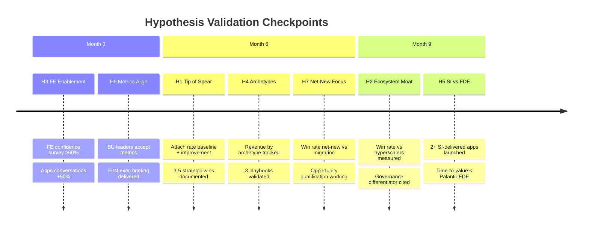

# Hypothesis Traceability Matrix

*This document maps each hypothesis to its validation path: what documents inform it, what actions test it, and what metrics prove or disprove it.*

**Related Documents:** [Hypotheses and Beliefs](08_hypotheses_and_beliefs.md) | [Action Plan](10_action_plan.md) | [Strategic Inputs](09_strategic_inputs.md)

---

## Traceability Framework

```
┌─────────────────────────────────────────────────────────────────┐
│                    TRACEABILITY CHAIN                           │
├─────────────────────────────────────────────────────────────────┤
│                                                                 │
│   HYPOTHESIS ──► INFORMED BY ──► TESTED BY ──► VALIDATED BY    │
│                                                                 │
│   Your belief    Documents that   Actions that   Metrics that   │
│                  shape it         test it        prove/disprove │
│                                                                 │
│                           ↓                                     │
│                                                                 │
│              IF VALIDATED              IF INVALIDATED           │
│              ────────────              ───────────────           │
│              Scale the action          Pivot strategy            │
│              Update playbooks          Update hypothesis         │
│              Share learnings           Document learnings        │
│                                                                 │
└─────────────────────────────────────────────────────────────────┘
```

### Validation Timeline



---

## Master Traceability Table

| ID | Hypothesis | Informed By | Tested By | Validated By | Status |
|----|------------|-------------|-----------|--------------|--------|
| H1 | Apps as Tip of the Spear | 04_gtm, 09_inputs | Strategic wins, Attach tracking | Attach rate, Influenced ACV | ⬜ |
| H2 | Ecosystem Moat | 03_moat, 05_patterns | Competitive wins, Messaging | Win rate vs hyperscalers | ⬜ |
| H3 | FE Enablement Blocker | 04_gtm, 09_inputs | Enablement sprint | FE confidence, Apps conversations | ⬜ |
| H4 | Three Archetypes | 05_patterns, 09_inputs | Playbook pilots | Revenue by archetype | ⬜ |
| H5 | SI vs FDE | 06_partners, 03_moat | SI pilot | SI-delivered Apps, TTV | ⬜ |
| H6 | Metrics Align BUs | 04_gtm, 09_inputs | BU alignment | BU investment in Apps GTM | ⬜ |
| H7 | Net-New Focus | 02_product, 05_patterns | Opportunity qualification | Win rate net-new vs migration | ⬜ |

---

## Detailed Traceability by Hypothesis

### H1: Apps as Tip of the Spear

```
┌─────────────────────────────────────────────────────────────────┐
│ H1: APPS AS TIP OF THE SPEAR                                    │
├─────────────────────────────────────────────────────────────────┤
│                                                                 │
│ BELIEF                                                          │
│ Apps drive influenced revenue > direct revenue                  │
│                                                                 │
│ INFORMED BY                           TESTED BY                 │
│ ───────────                           ─────────                 │
│ • 04_gtm: Tip of spear narrative      • Strategic wins (P1)     │
│ • 09_inputs: Attach rate definitions  • Attach tracking (P2)    │
│ • 09_inputs: North star metrics       • Coverage push (P3)      │
│                                                                 │
│ VALIDATED BY                          DECISION POINT            │
│ ────────────                          ──────────────            │
│ • Attach rate > baseline              Month 6: Is attach rate   │
│ • Influenced ACV measurable           improving? If yes, scale. │
│ • Expansion velocity                  If no, reassess narrative.│
│                                                                 │
└─────────────────────────────────────────────────────────────────┘
```

| Phase | Action | Timeline | Owner | Output |
|-------|--------|----------|-------|--------|
| P1 | Document strategic wins with attach narrative | M1-M3 | Adoption Architect | 3-5 win stories |
| P2 | Implement attach rate tracking | M4 | Analytics + AA | Dashboard live |
| P2 | Establish attach rate baseline | M6 | Analytics | Baseline number |
| P3 | Measure attach rate improvement | M9-M12 | Analytics | Trend data |

| Metric | Source | Target | Current |
|--------|--------|--------|---------|
| Attach rate (% expand to other SKUs) | SFDC + telemetry | TBD | Not measured |
| Time-to-expansion (days) | Telemetry | TBD | Not measured |
| Influenced ACV | Finance | TBD | Not measured |

---

### H2: Ecosystem Synergy Is the Moat

```
┌─────────────────────────────────────────────────────────────────┐
│ H2: ECOSYSTEM SYNERGY IS THE MOAT                               │
├─────────────────────────────────────────────────────────────────┤
│                                                                 │
│ BELIEF                                                          │
│ Lakebase + Governance + AI = defensible moat                    │
│                                                                 │
│ INFORMED BY                           TESTED BY                 │
│ ───────────                           ─────────                 │
│ • 03_moat: Flywheel effect            • Competitive wins        │
│ • 03_moat: Pillar definitions         • Multi-product deals     │
│ • 05_patterns: Fit assessment         • Win/loss analysis       │
│                                                                 │
│ VALIDATED BY                          DECISION POINT            │
│ ────────────                          ──────────────            │
│ • Win rate vs hyperscalers            Month 6: Are multi-product│
│ • Multi-product correlation           customers expanding more? │
│ • Customer quotes                     If yes, emphasize moat.   │
│                                                                 │
└─────────────────────────────────────────────────────────────────┘
```

| Phase | Action | Timeline | Owner | Output |
|-------|--------|----------|-------|--------|
| P1 | Capture competitive win stories | M1-M3 | Adoption Architect | Win narratives |
| P2 | Multi-product correlation analysis | M4-M6 | Analytics | Correlation data |
| P2 | Win/loss analysis with moat attribution | M4-M6 | Adoption Architect | Loss patterns |

| Metric | Source | Target | Current |
|--------|--------|--------|---------|
| Competitive win rate vs hyperscalers | SFDC | TBD | Not measured |
| Multi-product usage correlation | Telemetry | TBD | Not measured |
| Customer moat quotes | Interviews | 5+ quotes | 0 |

---

### H3: Field Enablement Is the Critical Blocker

```
┌─────────────────────────────────────────────────────────────────┐
│ H3: FIELD ENABLEMENT IS THE CRITICAL BLOCKER                    │
├─────────────────────────────────────────────────────────────────┤
│                                                                 │
│ BELIEF                                                          │
│ FE skill gap (not product) is primary adoption blocker          │
│                                                                 │
│ INFORMED BY                           TESTED BY                 │
│ ───────────                           ─────────                 │
│ • 04_gtm: Field readiness gap         • Enablement sprint (P1)  │
│ • 09_inputs: Training priorities      • FE confidence survey    │
│ • 09_inputs: Top 3 blockers           • Win rate comparison     │
│                                                                 │
│ VALIDATED BY                          DECISION POINT            │
│ ────────────                          ──────────────            │
│ • FE confidence improvement           Month 3: Is FE confidence │
│ • Apps conversations increase         up? If yes, scale training│
│ • Enabled vs non-enabled win rate     If no, product is blocker.│
│                                                                 │
└─────────────────────────────────────────────────────────────────┘
```

| Phase | Action | Timeline | Owner | Output |
|-------|--------|----------|-------|--------|
| P1 | FE confidence survey (baseline) | M1 W2 | Adoption Architect | Baseline score |
| P1 | Security patterns training | M2 | Enablement + AA | Training delivered |
| P1 | App discovery workshop | M2-M3 | Enablement + AA | Workshop piloted |
| P1 | FE confidence survey (post) | M3 W4 | Adoption Architect | Post score |

| Metric | Source | Target | Current |
|--------|--------|--------|---------|
| FE confidence score | Survey | +20% improvement | Not measured |
| Apps conversations per FE | Activity tracking | TBD | Not measured |
| Win rate: Enabled vs non-enabled | SFDC | Enabled > non-enabled | Not measured |

---

### H4: Three App Archetypes Drive 80% of Adoption

```
┌─────────────────────────────────────────────────────────────────┐
│ H4: THREE APP ARCHETYPES DRIVE 80% OF ADOPTION                  │
├─────────────────────────────────────────────────────────────────┤
│                                                                 │
│ BELIEF                                                          │
│ Cockpit + Vertical + Horizontal = 80% of wins                   │
│                                                                 │
│ INFORMED BY                           TESTED BY                 │
│ ───────────                           ─────────                 │
│ • 05_patterns: Archetype definitions  • Customer classification │
│ • 09_inputs: Targeting framework      • Playbook pilots         │
│ • 09_inputs: Priority archetypes      • Revenue analysis        │
│                                                                 │
│ VALIDATED BY                          DECISION POINT            │
│ ────────────                          ──────────────            │
│ • Revenue distribution                Month 3: Does classifi-   │
│ • Win rate by archetype               cation hold? If yes, build│
│ • Playbook transferability            playbooks. If no, refine. │
│                                                                 │
└─────────────────────────────────────────────────────────────────┘
```

| Phase | Action | Timeline | Owner | Output |
|-------|--------|----------|-------|--------|
| P1 | Classify top 20 customers by archetype | M1 W2 | Adoption Architect | Classification |
| P2 | Business Cockpit playbook | M5 | Adoption Architect | Playbook v1 |
| P2 | Deep Vertical playbook | M5 | Adoption Architect | Playbook v1 |
| P2 | Playbook pilot with 2 FE teams | M5 W3 | AA + FE | Pilot feedback |

| Metric | Source | Target | Current |
|--------|--------|--------|---------|
| % of wins by archetype | SFDC analysis | 80% in 3 archetypes | Not measured |
| Win rate by archetype | SFDC | TBD | Not measured |
| Playbook adoption rate | Field feedback | 70% usage | Not measured |

---

### H5: SI Partnerships Can Counter Palantir's FDE Motion

```
┌─────────────────────────────────────────────────────────────────┐
│ H5: SI PARTNERSHIPS CAN COUNTER PALANTIR'S FDE MOTION           │
├─────────────────────────────────────────────────────────────────┤
│                                                                 │
│ BELIEF                                                          │
│ App-first SIs can scale like Palantir FDEs at lower cost        │
│                                                                 │
│ INFORMED BY                           TESTED BY                 │
│ ───────────                           ─────────                 │
│ • 06_partners: SI strategy            • SI pilot (P3)           │
│ • 03_moat: Palantir comparison        • SI enablement program   │
│ • 09_inputs: Lighthouse signals       • Joint customer wins     │
│                                                                 │
│ VALIDATED BY                          DECISION POINT            │
│ ────────────                          ──────────────            │
│ • SI time-to-value                    Month 9: Is SI pilot      │
│ • SI-sourced pipeline                 delivering? If yes, scale.│
│ • Customer satisfaction               If no, consider FDE build.│
│                                                                 │
└─────────────────────────────────────────────────────────────────┘
```

| Phase | Action | Timeline | Owner | Output |
|-------|--------|----------|-------|--------|
| P2 | SI partnership assessment | M6 | AA + Partners | Partner shortlist |
| P3 | SI enablement program design | M8 | AA + Partners | Enablement plan |
| P3 | SI pilot launch (1-2 partners) | M9 | Partners + AA | Pilot live |
| P3 | SI pilot retrospective | M11 | Partners + AA | Results analysis |

| Metric | Source | Target | Current |
|--------|--------|--------|---------|
| SI time-to-value vs internal | Project tracking | SI ≤ internal | Not measured |
| SI-sourced pipeline | SFDC | TBD | Not measured |
| SI customer satisfaction | CSAT | ≥ internal | Not measured |

---

### H6: Influenced Revenue Metrics Will Align BU Leaders

```
┌─────────────────────────────────────────────────────────────────┐
│ H6: INFLUENCED REVENUE METRICS WILL ALIGN BU LEADERS            │
├─────────────────────────────────────────────────────────────────┤
│                                                                 │
│ BELIEF                                                          │
│ Visible attach rates → BU leader investment in Apps GTM         │
│                                                                 │
│ INFORMED BY                           TESTED BY                 │
│ ───────────                           ─────────                 │
│ • 04_gtm: Attach rate metrics         • BU leader interviews    │
│ • 09_inputs: Metric definitions       • Metric proposal (M2)    │
│ • 09_inputs: Control surface          • Finance alignment       │
│                                                                 │
│ VALIDATED BY                          DECISION POINT            │
│ ────────────                          ──────────────            │
│ • BU leader buy-in                    Month 3: Do BU leaders    │
│ • Finance approval                    accept metrics? If yes,   │
│ • Comp plan discussion                operationalize. If no,    │
│                                       revise definitions.       │
│                                                                 │
└─────────────────────────────────────────────────────────────────┘
```

| Phase | Action | Timeline | Owner | Output |
|-------|--------|----------|-------|--------|
| P1 | BU leader interviews on metrics | M1-M2 | Adoption Architect | Feedback |
| P1 | Attach rate definition proposal | M2 W4 | Adoption Architect | Proposal doc |
| P2 | Finance alignment on methodology | M4-M5 | AA + Finance | Approved method |
| P2 | Attach rate dashboard | M4-M6 | Analytics + AA | Dashboard live |

| Metric | Source | Target | Current |
|--------|--------|--------|---------|
| BU leader acceptance | Stakeholder feedback | 3+ SVP/VPs | 0 |
| Finance approval | Finance team | Approved | Not submitted |
| Comp discussion | FE leadership | On agenda | Not started |

---

### H7: Net-New Apps (Not Migration) Is the Right Focus

```
┌─────────────────────────────────────────────────────────────────┐
│ H7: NET-NEW APPS (NOT MIGRATION) IS THE RIGHT FOCUS             │
├─────────────────────────────────────────────────────────────────┤
│                                                                 │
│ BELIEF                                                          │
│ Net-new apps win; migration attempts fail (for now)             │
│                                                                 │
│ INFORMED BY                           TESTED BY                 │
│ ───────────                           ─────────                 │
│ • 02_product: Limitations             • Opportunity tracking    │
│ • 02_product: Sweet spot              • Win/loss by opp type    │
│ • 05_patterns: Qualification Q1       • Pipeline analysis       │
│                                                                 │
│ VALIDATED BY                          DECISION POINT            │
│ ────────────                          ──────────────            │
│ • Win rate comparison                 Month 6: Is net-new       │
│ • Customer satisfaction               clearly winning? If yes,  │
│ • Pipeline composition                maintain focus. If mixed, │
│                                       reassess for FY27.        │
│                                                                 │
└─────────────────────────────────────────────────────────────────┘
```

| Phase | Action | Timeline | Owner | Output |
|-------|--------|----------|-------|--------|
| P1 | Tag opportunities as net-new vs migration | M1 | Sales Ops + AA | SFDC field |
| P2 | Win/loss analysis by opportunity type | M4-M6 | Adoption Architect | Analysis |
| P2 | Customer satisfaction by type | M5-M6 | CS + AA | CSAT data |

| Metric | Source | Target | Current |
|--------|--------|--------|---------|
| Win rate: Net-new vs migration | SFDC | Net-new > migration | Not measured |
| CSAT: Net-new vs migration | CSAT data | Net-new > migration | Not measured |
| Pipeline: % net-new | SFDC | >70% net-new | Not measured |

---

## Hypothesis Decision Timeline

```
┌─────────────────────────────────────────────────────────────────┐
│                    DECISION TIMELINE                            │
├─────────────────────────────────────────────────────────────────┤
│                                                                 │
│   MONTH 1-2          MONTH 3           MONTH 6        MONTH 9   │
│   ─────────          ───────           ───────        ───────   │
│                                                                 │
│   Baseline data      H3 Decision:      H1, H6, H7     H5 Decision│
│   collection         Enablement        Decisions:     SI Pilot   │
│                      working?          Metrics,       working?   │
│   H3: FE survey                        Attach,                   │
│   H4: Classification H6 Decision:      Net-new        H2 Decision│
│   H6: BU interviews  BU buy-in?                       Moat real? │
│                                        H4 Decision:              │
│                                        Archetypes                │
│                                        hold?                     │
│                                                                 │
└─────────────────────────────────────────────────────────────────┘
```

---

## Validation Status Dashboard

| Hypothesis | Data Status | Test Status | Decision Due | Decision |
|------------|-------------|-------------|--------------|----------|
| H1: Tip of Spear | ⬜ No baseline | ⬜ Not started | Month 6 | Pending |
| H2: Ecosystem Moat | ⬜ No baseline | ⬜ Not started | Month 9 | Pending |
| H3: FE Enablement | ⬜ No baseline | ⬜ Not started | Month 3 | Pending |
| H4: Three Archetypes | ⬜ No baseline | ⬜ Not started | Month 6 | Pending |
| H5: SI vs FDE | ⬜ No baseline | ⬜ Not started | Month 9 | Pending |
| H6: Metrics Align BUs | ⬜ No baseline | ⬜ Not started | Month 3 | Pending |
| H7: Net-New Focus | ⬜ No baseline | ⬜ Not started | Month 6 | Pending |

*Update this table as validation progresses.*

---

## If Hypothesis Is Invalidated

| Hypothesis | Pivot If Wrong |
|------------|----------------|
| H1: Tip of Spear | Reposition Apps as standalone value prop, not platform play |
| H2: Ecosystem Moat | Compete on specific features, not integration |
| H3: FE Enablement | Focus on product improvements, not training |
| H4: Three Archetypes | Develop more granular or different segmentation |
| H5: SI vs FDE | Consider internal FDE build for strategic accounts |
| H6: Metrics Align BUs | Find alternative alignment mechanism (exec mandate, etc.) |
| H7: Net-New Focus | Accelerate migration capability investment |

---

*Last Updated: January 2026*

